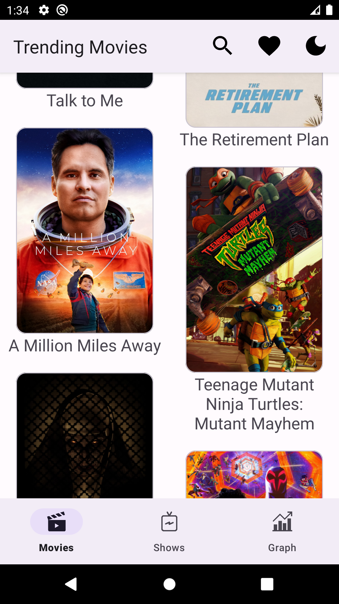
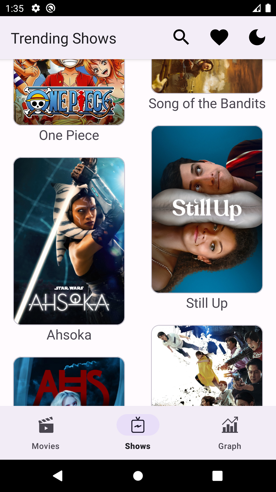
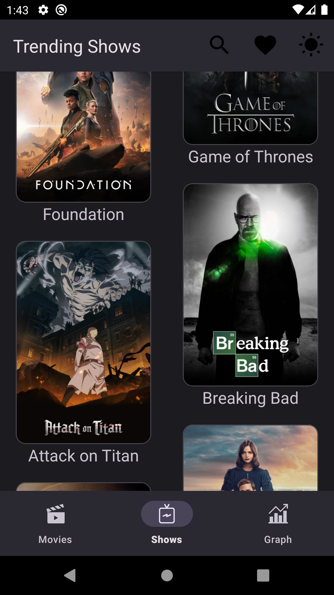
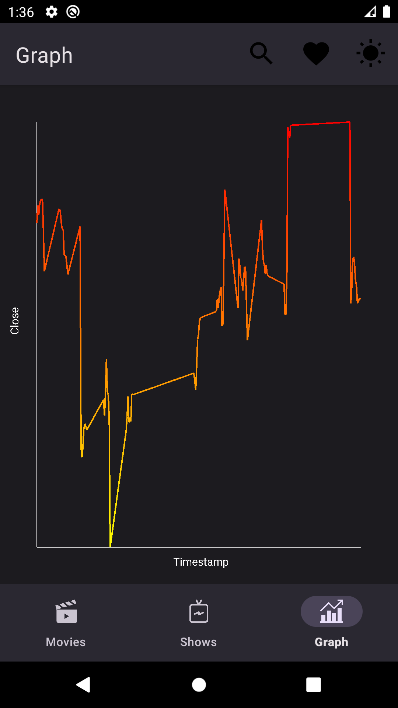
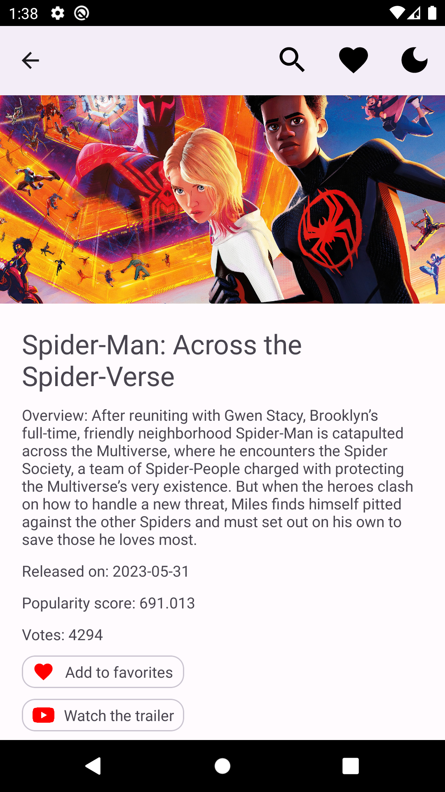
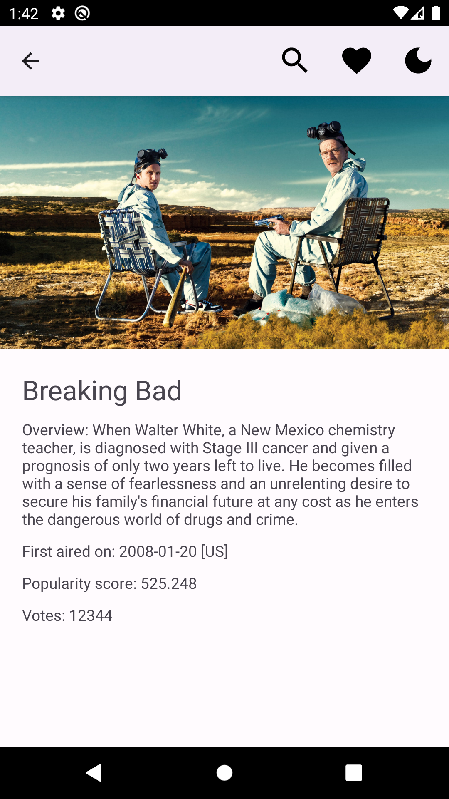
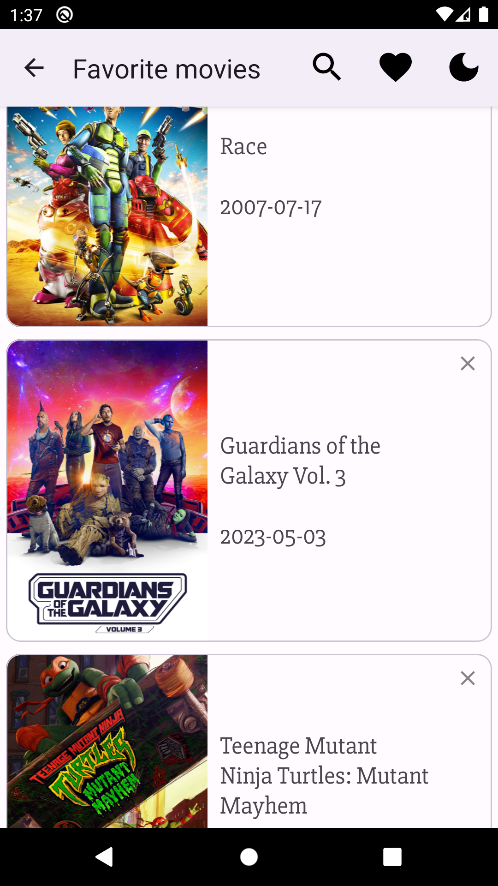
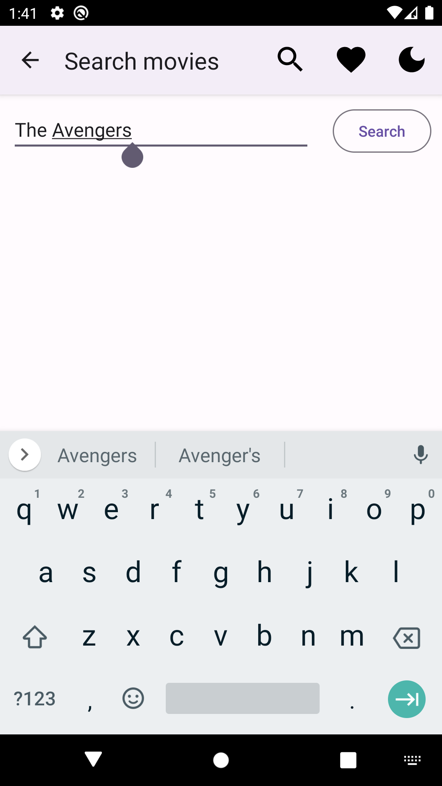
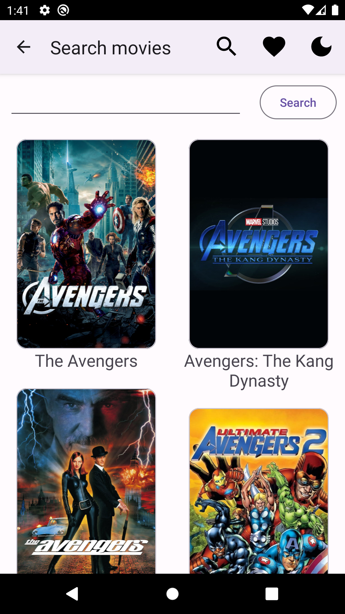

# MovieDB

Icon by <a href="https://www.themoviedb.org/" title="MovieDB logo">The Movie Database</a>

## Overview
The **MovieDB** is a movie information viewer app that does a data fetch from api.themoviedb.org and views it on the UI. It makes use of some of the latest and most popular libraries that are commonly used in the industry by most developers out there. This project was done to learn and test out these libraries.

### Key Features
- Fetches data from the [The Movie Database Api](https://www.themoviedb.org/) and views it as lists
- Caches the data
- Locally stores favorited items (Movies only for now)
- Shows media detail on list item tap
- Allows to watch trailers if available (Movies only for now)
- Reads data from a CSV and plots graph with gradiant paint
- Searches movies using keywords and views results as lists
- Has toggle button for theme change

### Planned Features
- Sort movies and shows using different criterias
- Add shows to favorites
- Allow to watch trailers for shows
- Search shows

### Tech stack
- [Kotlin](https://kotlinlang.org/)
- [Coroutines](https://github.com/Kotlin/kotlinx.coroutines)
- [Flow](https://kotlin.github.io/kotlinx.coroutines/kotlinx-coroutines-core/kotlinx.coroutines.flow/) - Flow sends a stream of data that can be computed asynchronously.
- [Dagger-Hilt](https://developer.android.com/training/dependency-injection/hilt-android)
- [LiveData](https://developer.android.com/topic/libraries/architecture/livedata)
- [Lifecycle](https://developer.android.com/jetpack/androidx/releases/lifecycle) - Provides lifecyle event of an activity or fragment.
- [ViewModel](https://developer.android.com/topic/libraries/architecture/viewmodel) - Stores UI-related data that isn't destroyed on UI changes.
- [Navigation](https://developer.android.com/guide/navigation/navigation-getting-started)
- [Data Binding](https://developer.android.com/topic/libraries/data-binding)
- [Retrofit](https://github.com/square/retrofit) - Provides REST api communication.
- [OkHttp](http://square.github.io/okhttp/)
- [Gson](https://github.com/google/gson) - Converts Java Objects to JSON and vice versa.
- [Glide](https://github.com/bumptech/glide) - Glide is a fast and efficient image loading library for Android
- [Room](https://developer.android.com/training/data-storage/room)
- [Canvas](https://docs.oracle.com/javase/8/docs/api/java/awt/Canvas.html)

## Screenshots
 
 
 
 
 

## Getting Started
These instructions will help you set up and run the project on your local machine for development and testing purposes.

### Prerequisites
- [Android Studio](https://developer.android.com/studio)
- Required [libraries](https://developer.android.com/studio/install#64bit-libs) for 64-bit Linux machines
- Android SDK
- Java 17

### Installation
1. Clone the repository by pasting the following command into your terminal:
```bash
   git clone git@github.com:sadman1148/MovieDB.git
```
2. Open the project in Android Studio and let it sync.
3. Connect a physical device or build a virtual device with the AVD manager.
4. Run the app.

### Usage
- Browse the movie and show list.
- Tap on any item to see details about it.
- Add movies to favorites
- Watch movie trailers
- Toggle app theme
- Search movies


## Contribution
I welcome contributions from the community. To contribute to this project, follow these steps:

1. Fork this repository.
2. Create a new branch for your feature or bug fix: git checkout -b feature/your-feature-name
3. Make your changes and commit them: git commit -m 'Added a new feature'
4. Push to your branch: git push origin feature/your-feature-name
5. Create a pull request on this repository.


## Contact
Feel free to contact me on my [LinkedIn](https://www.linkedin.com/in/sadman-alam-impulse/) profile.
